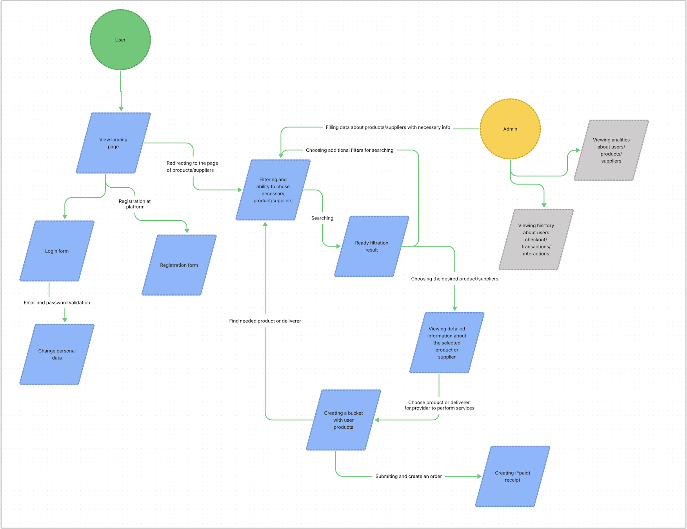
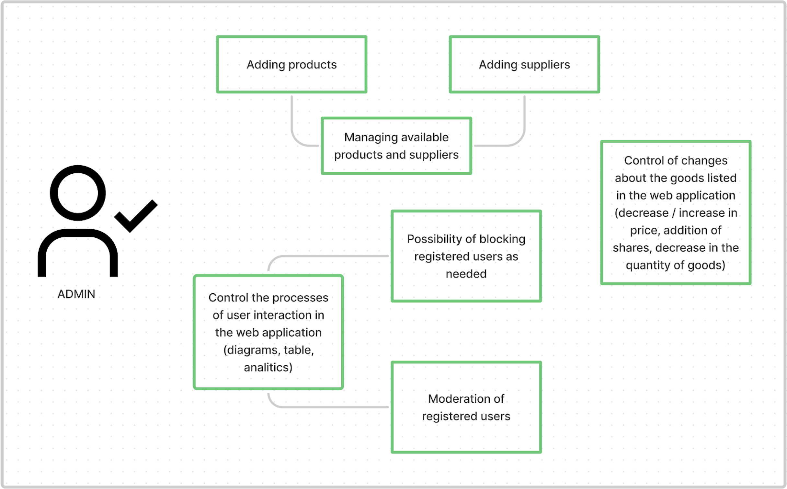
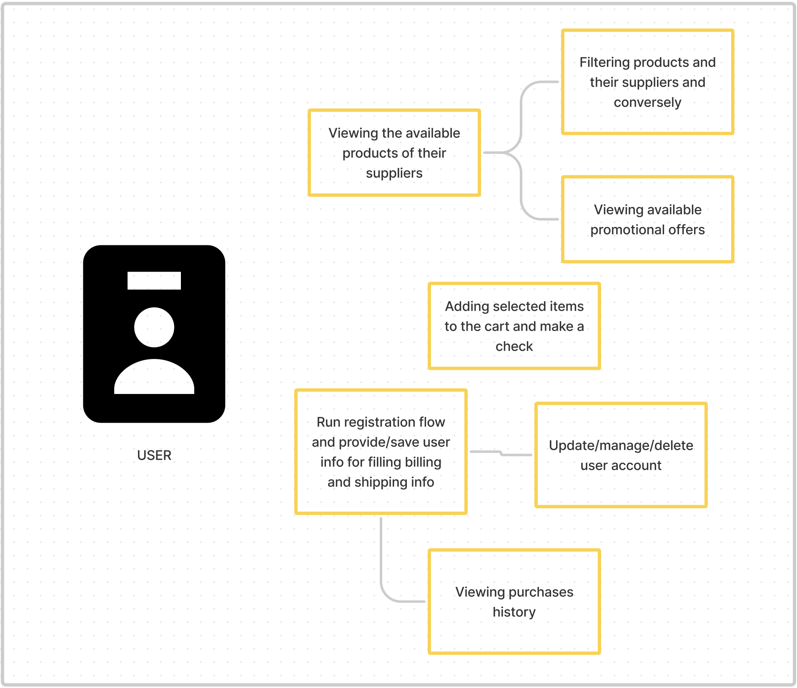

# SellEverywhere

## Overview
We want to create a hardware shop using popular technologies in a friendly team
(MKdir). Examples are any store selling goods. Current idea is to implement an
admin panel and user panel. The basic interface of the store was designed in [Figma](https://www.figma.com/file/Re4tXW7aNCWOzed7wI1GKe/dirStore).

### Basic flow

### The application must have the following functionality from the administrator perspective:

* authorization;
* authentication;
* creation of a new product (price, description, category, name, manufacturer, photo);
* manage existing products/deliverers (read/edit/delete);
* add new products/deliverers;
* view sales statistics for the selected category
  or popularity of the products for example (diagrams, table), provide analytics;
* control the processes of users interaction in application;
* moderation of registered users.

### Admin use case 

### The application must have the following functionality from the user:

* authorization;
* authentication;
* browse products by category;
* adding goods to the cart;
* view the cart and edit it;
* provide payment flow for goods;
* view the history of purchased goods;
* implement the ability to add comments to the specific product (nice to have);

### User use case

### Technologies for implementing:

* Frontend: Next.js, TypeScript, Redux;
* Database: MySQL / PostgresSQL;
* Backend: Nest.js, knex / sequelize;
* Testing: Jest (RTL / Enzyme);
* CI/CD: Versel, linters and tests.

## Additional instruments for developing:

* Postman;
* DBeaver.

### Technical requirements:

* Create database architecture;
* Develop REST API - contract first;
* Creating a minimalistic UI for the client and administrator (we have a design here);
* Hosting settings.

### Stages of work:

* project readme, writing a user story,
* design of data structures, and creation of ER diagrams.
* basic CI / CD settings, linters, naming conventions.
* writing basic business logic.
* writing basic business logic.
* writing basic business logic.
* writing tests.
* demo.

#### Main contributors: [Vlad](https://t.me/vlad_kucherenko), [Diana](https://t.me/noir_kotyara), [Dima](https://t.me/dimma_life).

#### The purpose of creating this repository was to learn how to develop a product in a team with specified technologies.
